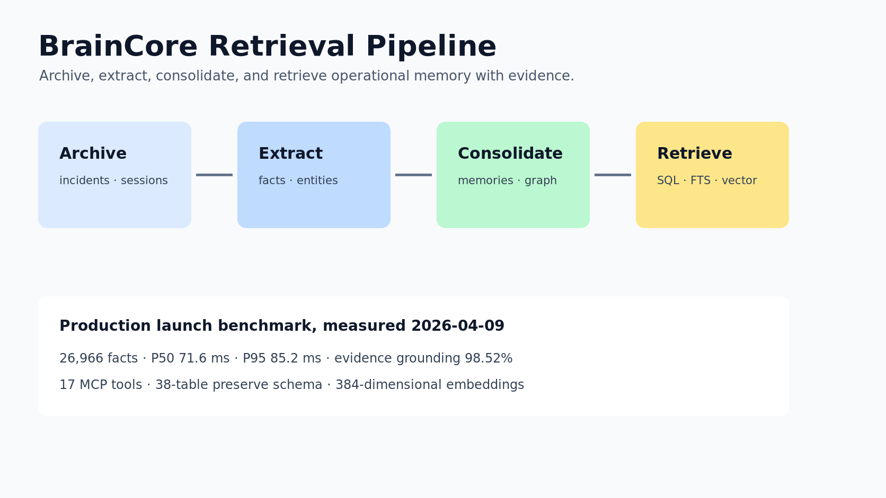
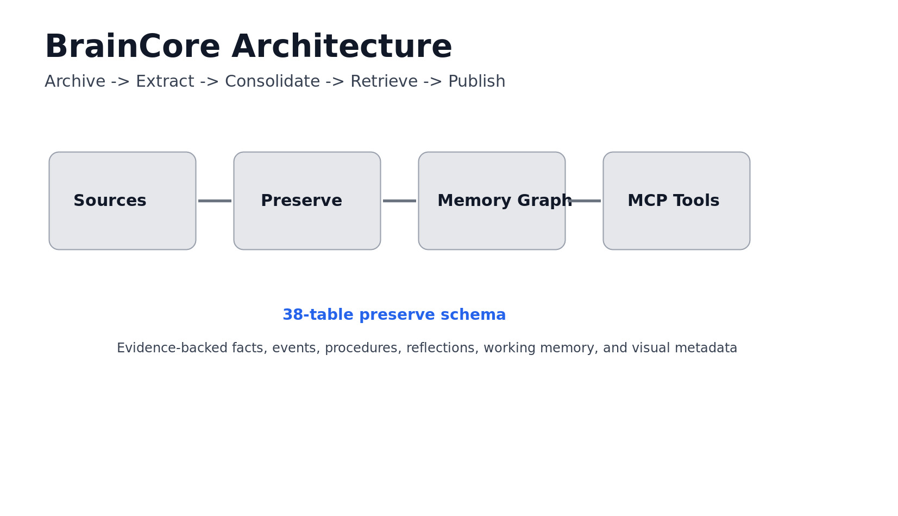

<div align="center">
  
  <h1>BrainCore</h1>
  <p>
    <strong>Autonomous memory system for AI infrastructure.</strong>
  </p>
  <p>
    BrainCore extracts, preserves, and retrieves operational knowledge from incidents, coding sessions, chat messages, and monitoring data, building a persistent knowledge graph that AI agents can query.
  </p>
  <p>
    <a href="https://github.com/trentdoney/BrainCore/releases"></a>
    <a href="https://github.com/trentdoney/BrainCore"></a>
    <a href="LICENSE"></a>
    
    <a href="https://github.com/trentdoney/BrainCore/actions/workflows/ci.yml"></a>
  </p>
  <p>
    <strong>Production launch measurements, April 2026:</strong> 26,966 facts · P50 71.6 ms · P95 85.2 ms with vector stream disabled · fact-evidence coverage 98.52%
  </p>
  <p>
    <a href="#what-it-does">What It Does</a> ·
    <a href="#features">Features</a> ·
    <a href="#quick-start">Quick Start</a> ·
    <a href="#what-ships-in-this-repo">What Ships</a> ·
    <a href="#architecture">Architecture</a> ·
    <a href="#benchmarks">Benchmarks</a> ·
    <a href="#mcp-integration">MCP Integration</a> ·
    <a href="#configuration">Configuration</a>
  </p>
</div>

## What It Does

BrainCore processes operational artifacts and automatically:

1. **Archives** incidents, sessions, and artifacts with integrity checksums
2. **Extracts** structured facts using deterministic parsing plus LLM semantic analysis
3. **Consolidates** recurring patterns into actionable memories and playbooks
4. **Publishes** knowledge as searchable, queryable data

All knowledge is stored in PostgreSQL with pgvector, enabling four core retrieval streams (SQL + full-text + vector + temporal) plus optional graph-path retrieval with Reciprocal Rank Fusion.

<p align="center">
  
</p>

## Quality Standard

BrainCore is maintained as a public, client-visible engineering artifact.
Every public change is expected to be reviewed at the level of production
software:

- Documentation, tests, migrations, and benchmark evidence must agree in
  the same change set.
- Public numeric claims must be backed by `benchmarks/claims-to-evidence.yaml`
  or a committed benchmark artifact.
- Routine work should land through pull requests with required GitHub Actions
  checks, not direct pushes to `main`.
- If CI fails, the follow-up should make the root cause and verification clear
  instead of papering over the failure.
- Private hosts, home paths, tokens, and deployment-only details must stay out
  of tracked public files.

## Features

- **Source ingestion**: incident notes plus deterministic parsers for Claude Code, Codex, Codex shared memory, Discord, Telegram, Grafana, personal memory, Asana task exports, and Git commits
- **Hybrid retrieval**: Structured SQL + FTS + vector similarity + temporal expansion, with optional graph path search, fused with RRF (`k=60`)
- **Trust classes**: `deterministic`, `corroborated_llm`, `single_source_llm`, `human_curated`
- **Project scoping**: Facts, memories, and episodes auto-tagged to projects via service mapping
- **Quality gate**: SHA256 fingerprint dedup, secret redaction, and assertion-class validation
- **Local-first LLM**: Uses vLLM (OpenAI-compatible); Claude CLI fallback requires explicit operator opt-in
- **Risk review queue**: semantic truncation, prompt-injection heuristics, redaction hits, and high-risk fact kinds are queued for human review
- **Parallel nightly pipeline**: Automated archive-extract-consolidate-publish cycle with parallel extractors and health gating
- **Eval framework**: Gold-set benchmark with precision, recall, and fact-evidence coverage metrics
- **MCP-ready retrieval layer**: Python retrieval library plus a FastMCP example server for downstream tool exposure

## Quick Start

The fastest supported way to try BrainCore on a fresh clone is:

1. Install Bun and Python dependencies.
2. Start PostgreSQL with pgvector.
3. Apply the schema migrations with `bun src/cli.ts migrate`.
4. Run the retrieval smoke benchmark to prove the repo wiring works.
5. Start the example MCP server or query the retrieval library directly.

### Requirements

- Bun 1.1+
- Python 3.11+
- `PostgreSQL 15+ (tested on 16)`
- Docker or a local PostgreSQL instance with pgvector enabled

### 1. Install dependencies

```bash
bun install
python -m venv .venv
source .venv/bin/activate
pip install 'psycopg[binary]>=3.1' psycopg-pool pyyaml numpy requests pgvector pydantic 'mcp[cli]>=1.0'
```

### 2. Start PostgreSQL with pgvector

```bash
docker compose -f examples/docker-compose.yml up -d
sleep 5
cp .env.example .env
$EDITOR .env
# Optional: set BRAINCORE_EMBED_AUTH_TOKEN if your /embed endpoint requires auth.
set -a && . ./.env && set +a
```

### 3. Apply migrations

The supported launch path is `bun src/cli.ts migrate`.

```bash
bun src/cli.ts migrate
```

The migration runner connects with `BRAINCORE_POSTGRES_DSN` directly. It does
not require the `psql` binary on the application host. Applied migrations are
recorded in `preserve.schema_migration`; existing deployments with a complete
schema are baselined into the ledger instead of re-running data rewrites.

If the PostgreSQL client is installed, you can sanity-check the
open-source schema shape like this:

```bash
psql "$BRAINCORE_POSTGRES_DSN" \
  -c "SELECT count(*) FROM pg_tables WHERE schemaname='preserve';"
```

Expected result on a fresh clone: `38-table preserve schema`.

### 4. Run the smoke benchmark

```bash
export BRAINCORE_TEST_DSN="$BRAINCORE_POSTGRES_DSN"
python benchmarks/run_retrieval.py
python benchmarks/run_grounding.py
```

This auto-loads `benchmarks/seed_smoke.sql` if `preserve.fact` is empty
and writes:

- `benchmarks/results/2026-04-09-retrieval.json`
- `benchmarks/results/2026-04-09-grounding.json`

Those files are smoke-regression artifacts. They prove the pipeline is
wired correctly. They are not the same thing as the live-deployment
benchmark artifacts used for the public metrics.

### 5. Query BrainCore directly

From Python:

```python
import os
from psycopg_pool import ConnectionPool
from mcp.memory_search import memory_search

pool = ConnectionPool(conninfo=os.environ["BRAINCORE_POSTGRES_DSN"])
result = memory_search(pool, query="docker restart loop", limit=5)
print(result["results"][0]["title"])
```

Or start the example MCP server:

```bash
python -m examples.mcp_server.server
```

See [`examples/mcp_server/README.md`](examples/mcp_server/README.md) for
Claude Desktop and Inspector configuration.

## Why It Exists

Most operational knowledge dies in one of four places:

- The incident note that never gets revisited.
- The chat thread that solved the problem but was never normalized.
- The coding session that found the root cause but never made it into a
  runbook.
- The monitoring alert that contained the first signal but not the final
  explanation.

Traditional RAG setups index documents. BrainCore tries to preserve
knowledge. That changes the design:

- Artifacts are archived before they are interpreted.
- Facts carry provenance and temporal validity windows.
- Weak facts can still be searchable without being allowed to promote
  into durable memory.
- Consolidation produces patterns and playbooks rather than just
  embeddings over raw text.

The result is a system that can answer questions like "what changed,
when, why, and how confident are we?" rather than only "which chunk of
text had similar words?"

## What Ships In This Repo

| Path | What it is | Why it matters |
|---|---|---|
| `src/` | Bun CLI and write path | Owns archive, extract, consolidate, publish, health, maintenance, and project lifecycle |
| `mcp/` | Python retrieval library | Owns read-side hybrid retrieval and typed request/response models |
| `sql/` | Schema migrations | Defines the open-source preserve schema and launch hardening fixes |
| `benchmarks/` | Smoke + production benchmark artifacts | Gives you reproducible proof and a claim-binding gate |
| `examples/mcp_server/` | Minimal example MCP server | Shows how to expose BrainCore through FastMCP without pretending the repo ships a full server |
| `cron/` | Nightly automation | Encodes the archive → extract → consolidate → publish cadence |
| `scripts/pre-push-gate.sh` | Sanitization gate | Blocks hostnames, private paths, secrets, and private project leakage |
| `tests/` and `src/__tests__/` | Launch smoke tests | Verifies imports, migrations, and open-source schema shape |

What does **not** ship:

- A hosted control plane
- A general-purpose agent framework
- The larger downstream operational vault MCP deployment
- A Docker image or GHCR publish flow

## Architecture

BrainCore uses the observatory metaphor as a teaching scaffold, not as a
branding costume.

- An artifact is the photographic plate. BrainCore preserves it first so
  later extractors can re-read it without losing the original evidence.
- Deterministic extraction is the first look through the eyepiece: the
  obvious signals you can recover without model inference.
- Semantic extraction is the fainter second pass: useful, but never
  allowed to erase the direct observation.
- Trust classes are magnitudes. The brighter the source, the more
  aggressively BrainCore can promote it into durable memory.
- The four core retrieval streams are the four axes of the fix.
  BrainCore aligns them with RRF so SQL, text, vector, and time each
  contribute without any one stream pretending to be the whole sky.
  Graph-path retrieval is an opt-in fifth signal for deployments that
  have populated and reviewed memory edges.

## Benchmark Methodology

BrainCore keeps smoke-regression and production-corpus measurements
separate on purpose.

### Production proof

| Scope | Metric | Value | Source |
|---|---|---:|---|
| Production corpus | facts | 26,966 | `benchmarks/results/2026-04-09-retrieval-production.json` |
| Production corpus | P50 latency with vector stream disabled | 71.6 ms | `benchmarks/results/2026-04-09-retrieval-production.json` |
| Production corpus | P95 latency with vector stream disabled | 85.2 ms | `benchmarks/results/2026-04-09-retrieval-production.json` |
| Production corpus | fact-evidence coverage | 98.52% | `benchmarks/results/2026-04-09-grounding-production.json` |

These are the public headline numbers.

### Smoke proof

| Scope | Metric | Value | Source |
|---|---|---:|---|
| Smoke fixture | facts | 9 | `benchmarks/results/2026-04-09-retrieval.json` |
| Smoke fixture | canonical queries | 12 | `benchmarks/results/2026-04-09-retrieval.json` |
| Smoke fixture | relevance at 10 | 41.67% | `benchmarks/results/2026-04-09-retrieval.json` |
| Smoke fixture | grounding rate | 55.56% | `benchmarks/results/2026-04-09-grounding.json` |

These are regression signals, not headline claims.

### Data flow

```text
data sources
    |
    v
+-------------+     +------------------+     +------------------+
| archive      | --> | extract facts     | --> | quality gate      |
| checksum     |     | deterministic     |     | trust classes     |
| ttl state    |     | semantic fallback |     | evidence anchors  |
+-------------+     +------------------+     +------------------+
          |                         |                      |
          +-------------------------+----------------------+
                                    |
                                    v
                           +------------------+
                           | preserve schema   |
                           | facts, memories,  |
                           | entities, review  |
                           +------------------+
                                    |
                                    v
                           +------------------+
                           | hybrid retrieval  |
                           | SQL + FTS + vec   |
                           | + temporal (RRF)  |
                           +------------------+
                                    |
                                    v
                           +------------------+
                           | notes, tools,     |
                           | timelines, MCP    |
                           +------------------+
```



### Trust classes

BrainCore uses four active trust classes in the shipped schema:

| Trust class | Typical source | Promotion behavior |
|---|---|---|
| `deterministic` | Parsed directly from logs, YAML, or strongly-typed files | Can promote into patterns and playbooks |
| `human_curated` | Operator-approved corrections or summaries | Highest editorial confidence |
| `corroborated_llm` | Model output confirmed by multiple evidence sources | Eligible for durable memory |
| `single_source_llm` | Model output from one source only | Searchable, but not trusted enough to promote by itself |

Retired facts remain queryable for provenance but do not behave like
active truth.

## Real-World Example Queries

The read path is designed for operational questions, not for generic
chat summaries.

| Query | Best entry point | Expected answer shape |
|---|---|---|
| "why did docker start flapping after the disk filled?" | `memory_search(..., query=...)` | facts + timeline evidence |
| "what changed on this service last week?" | `memory_search(..., as_of=..., scope=...)` | active facts with temporal windows |
| "show me prior incidents involving SSL renewal" | `memory_search(..., type_filter='episode')` | incidents and summaries |
| "what playbook do we already have for pgvector indexing drift?" | `memory_search(..., type_filter='memory')` | patterns and playbooks |
| "what was the state of nginx before the migration?" | `memory_search(..., as_of='...')` | point-in-time fact set |
| "which facts support this memory?" | retrieval + provenance objects | evidence spans and supporting facts |

Example:

```python
import os
from psycopg_pool import ConnectionPool
from mcp.memory_search import memory_search

pool = ConnectionPool(conninfo=os.environ["BRAINCORE_POSTGRES_DSN"])

result = memory_search(
    pool,
    query="ssl certificate renewal failure",
    type_filter="fact",
    limit=5,
)

for row in result["results"]:
    print(row["object_type"], row["title"], row["score"])
```

## Knowledge Graph

The open-source repo ships a `38-table preserve schema`. The tables are
split by lifecycle rather than by document format.

| Table | Purpose |
|---|---|
| `artifact` | master record for archived source material |
| `segment` | evidence spans, excerpts, embeddings, and scope |
| `extraction_run` | audit trail for extraction attempts |
| `schema_migration` | migration ledger for applied SQL files and baselined deployments |
| `entity` | devices, services, projects, incidents, sessions, config items |
| `episode` | time-bounded incidents or sessions |
| `event` | discrete events inside an episode |
| `fact` | the central truth table with confidence and validity windows |
| `fact_evidence` | fact-to-segment support links |
| `memory` | consolidated patterns, heuristics, playbooks, summaries |
| `memory_support` | memory-to-fact and memory-to-episode support |
| `publish_note` | publish-state tracking for promoted memory notes |
| `review_queue` | human review and moderation workflow |
| `project_service_map` | service-to-project scoping map |
| `eval_run` | stored evaluation runs and aggregate metrics |
| `eval_case` | gold-set cases used by the eval path |
| `memory_edge` | typed graph links between facts, memories, episodes, entities, and events |
| `memory_edge_evidence` | provenance for graph edges |
| `memory_revision` | audit log for memory creation, enrichment, merge, demotion, and retirement |
| `memory_revision_support` | evidence links for memory revisions |
| `event_frame` | structured actor/action/target/cause/effect timeline frames |
| `procedure` | evidence-grounded reusable operational workflows |
| `procedure_step` | ordered workflow steps and expected observations |
| `reflection_class` | derived-memory class registry |
| `entity_summary` | synthesized entity state with primary evidence |
| `entity_summary_evidence` | provenance for entity summaries |
| `belief` | inferred operational belief kept separate from facts |
| `belief_evidence` | support and counter-evidence for beliefs |
| `rule` | evidence-linked operational invariant or policy |
| `rule_evidence` | support and counter-evidence for rules |
| `memory_usage` | scoped retention and staleness snapshot |
| `memory_health` | deterministic memory health/risk assessment |
| `memory_health_evidence` | evidence for health decisions |
| `task_session` | active agent or task session state |
| `working_memory` | expiring session-local memory with explicit promotion status |
| `media_artifact` | media metadata for screenshots, images, pages, video, and documents |
| `visual_region` | layout-aware regions linked to grounded objects |
| `embedding_index` | multi-vector embeddings by target kind and vector role |

Key properties of the graph:

- Facts are temporal, not timeless.
- Evidence anchors survive re-extraction.
- Project identity is keyed through entities and service mapping, not
  by ad hoc string matching in every query.
- Retrieval can filter by scope and point in time without changing the
  underlying data model.

For a deeper design walkthrough, see
[`ARCHITECTURE.md`](ARCHITECTURE.md).

## Hybrid Retrieval Streams

BrainCore's retrieval library uses the same four streams on every query:

1. Structured SQL over entities and active facts.
2. Full-text search over facts, memories, segments, and episodes.
3. Vector similarity when an embedding service is configured.
4. Temporal and relation expansion to enrich the candidate set.

These are fused through Reciprocal Rank Fusion with `RRF_K = 60`.

The important design choice is that BrainCore does not force every query
through vector search. If the embedder is unavailable, the system
degrades to SQL + FTS + temporal expansion instead of failing the whole
request.

```python
results = memory_search(
    pool,
    query="postgres replication lag root cause",
    scope="project:system-infra",
    as_of="2026-04-01T00:00:00Z",
    limit=10,
)
```

The response includes:

- `results`
- `query_time_ms`
- `stream_counts`

That makes it possible to debug retrieval behavior without guessing
which stream contributed the hit.

## The 9 Data Sources

BrainCore currently ships `9 deterministic parsers`.

| Parser | Input | Typical output |
|---|---|---|
| `session-parser.ts` | Claude session JSONL | incidents, decisions, remediation facts |
| `codex-parser.ts` | Codex history/session logs | coding-session facts and timelines |
| `codex-shared-parser.ts` | Codex shared memory trees | shared session artifacts |
| `discord-parser.ts` | Discord digest database | conversational operational facts |
| `telegram-parser.ts` | Telegram export or feed | alerts and operator notes |
| `grafana-parser.ts` | dashboard and alert payloads | monitoring-alert facts |
| `personal-memory-parser.ts` | personal memory markdown | curated memory and reference facts |
| `asana-parser.ts` | Asana task export JSON/JSONL | task state, routing, project, and custom-field facts |
| `git-parser.ts` | git commit JSON/JSONL or local repository | commit timeline, author, and touched-file facts |

The repo also contains extractor infrastructure files such as
`deterministic.ts`, `semantic.ts`, `quality-gate.ts`,
`project-resolver.ts`, and `verify.ts`, but those are framework pieces,
not source parsers themselves.

## MCP Integration

BrainCore does not claim to ship a full MCP appliance. It ships the
retrieval library plus a small reference server in
[`examples/mcp_server/`](examples/mcp_server/).

That example exists to prove three things:

- The retrieval library can be exposed over stdio transport.
- The repo-root `mcp/` namespace collision can be handled safely.
- Pool creation can stay lazy so CI and tool introspection do not need a
  live database at import time.

The example server exposes the reference stdio MCP tool surface listed
in [`examples/mcp_server/README.md`](examples/mcp_server/README.md):
search, timeline, before/after, causal-chain, procedure, visual
metadata, and working-memory session tools. It is still a reference
server, not a hardened remote MCP appliance. If your deployment wraps
these tools in HTTP, SSE, WebSocket, or another network transport, add
authentication, tenant policy, write-tool authorization, request
limits, and privacy review before exposing it.

Start here:

- [`examples/mcp_server/server.py`](examples/mcp_server/server.py)
- [`examples/mcp_server/README.md`](examples/mcp_server/README.md)
- [`mcp/memory_search.py`](mcp/memory_search.py)
- [`mcp/memory_models.py`](mcp/memory_models.py)

## The Nightly Pipeline

`cron/nightly.sh` is the automation backbone. It is intentionally
failure-tolerant:

- `flock` prevents overlap between runs.
- Archive and extraction steps can fail independently without tearing
  down the whole night.
- Post-processing happens in a clear sequence: embeddings, project
  tagging, consolidate, publish.
- Weekly and monthly maintenance are gated by date rather than hidden in
  separate jobs.
- Telegram notifications are optional, not mandatory.

The pipeline is designed to prefer partial progress over all-or-nothing
fragility.

## Benchmarks

BrainCore keeps two kinds of benchmark artifacts in the repo:

- **Production-corpus measurements** for the launch README claims.
- **Smoke-regression fixtures** for CI and refactor protection.

### Live deployment measurements

| Scope | Metric | Value | Source |
|---|---|---:|---|
| Production corpus | facts | 26,966 | `benchmarks/results/2026-04-09-retrieval-production.json` |
| Production corpus | P50 latency with vector stream disabled | 71.6 ms | `benchmarks/results/2026-04-09-retrieval-production.json` |
| Production corpus | P95 latency with vector stream disabled | 85.2 ms | `benchmarks/results/2026-04-09-retrieval-production.json` |
| Production corpus | fact-evidence coverage | 98.52% | `benchmarks/results/2026-04-09-grounding-production.json` |

These values are measured against a live deployment. They are valid
README claims because they come from committed production-corpus
artifacts, not from the synthetic smoke fixture.

### Smoke-regression measurements

| Scope | Metric | Value | Source |
|---|---|---:|---|
| Smoke fixture | facts | 9 | `benchmarks/results/2026-04-09-retrieval.json` |
| Smoke fixture | canonical queries | 12 | `benchmarks/results/2026-04-09-retrieval.json` |
| Smoke fixture | relevance at 10 | 41.67% | `benchmarks/results/2026-04-09-retrieval.json` |
| Smoke fixture | grounding rate | 55.56% | `benchmarks/results/2026-04-09-grounding.json` |

The smoke fixture numbers are intentionally synthetic. They exist so a
change to the retrieval path can be caught quickly and reproducibly in
CI. They are not representative of live-corpus quality.

### One important omission

The production retrieval artifact records `relevance_at_10 = 0.0` for
the canonical 12-query set. That is not a contradiction; it is a scope
issue. The canonical queries are tuned to the synthetic sample incidents
used by the smoke fixture, while the live deployment contains a
different corpus. BrainCore therefore uses the production artifact for
facts, latency, and evidence coverage, and uses the smoke artifact only
for regression-only relevance checks.

To inspect or reproduce the benchmark artifacts, start with
[`benchmarks/README.md`](benchmarks/README.md).

## CLI Commands

The CLI is intentionally narrow and explicit.

| Command | Purpose |
|---|---|
| `archive --pending` | move discovered artifacts into archived state |
| `extract --pending` | process pending artifacts through the extraction path |
| `extract --session <path>` | extract one session file |
| `extract --personal-memory` | process personal memory markdown |
| `extract --codex-history` | ingest Codex history/session data |
| `extract --codex-shared` | ingest Codex shared memory content |
| `extract --discord` | ingest Discord digest data |
| `extract --telegram` | ingest Telegram chat data |
| `extract --grafana` | ingest Grafana dashboards and alerts |
| `extract --asana-export <path> [--dry-run]` | ingest exported Asana task JSON or JSONL |
| `extract --git-commits <repo-or-export> [--since <ref>] [--dry-run]` | ingest local git commits or exported commit JSON/JSONL |
| `consolidate --delta` | compile patterns and playbooks from new facts |
| `publish-notes --changed` | write updated markdown memories |
| `eval --run` | execute the eval harness against `eval_case` rows |
| `eval --report` | print the last eval report |
| `project list` / `summary` / `archive` / `merge` / `fork` | lifecycle operations on project entities |
| `maintenance --stats` / `--vacuum` / `--detect-stale` | database maintenance and drift checks |
| `health-check` | verify configured vLLM endpoints |
| `gate-check` | surface blocked or failed artifacts |

Run `bun src/cli.ts --help` for the exact runtime usage block.

## Configuration

Core configuration lives in `.env.example`.

| Variable | Required | Purpose |
|---|---|---|
| `BRAINCORE_POSTGRES_DSN` | yes | PostgreSQL connection string |
| `BRAINCORE_VAULT_ROOT` | yes | source vault or incident root |
| `BRAINCORE_ARCHIVE_ROOT` | yes | archive storage root |
| `BRAINCORE_ARCHIVE_BACKUP` | yes | redundancy target for archived artifacts |
| `BRAINCORE_PUBLISH_DIR` | yes | published memory note output |
| `BRAINCORE_VLLM_ENDPOINTS` | no | semantic extraction endpoints |
| `BRAINCORE_ALLOW_EXTERNAL_LLM_FALLBACK` | no | opt-in Claude CLI fallback when local vLLM is unavailable |
| `BRAINCORE_EMBED_URL` | no | embedding service URL for vector retrieval |
| `BRAINCORE_EMBEDDING_INDEX_RETRIEVAL` | no | opt-in MCP retrieval from role-specific `embedding_index` rows; defaults to legacy table embedding columns |
| `BRAINCORE_TENANT` | no | tenant scope for writes and reads |
| `BRAINCORE_GRAFANA_URL` / `BRAINCORE_GRAFANA_API_KEY` | no | Grafana extraction integration |
| `BRAINCORE_TELEGRAM_BOT_TOKEN` / `BRAINCORE_TELEGRAM_CHAT_ID` | no | pipeline notifications |
| `BRAINCORE_TELEGRAM_INGEST` | no | set to `1` to ingest Telegram updates during nightly extraction |
| `BRAINCORE_ASANA_EXPORT` | no | opt-in nightly Asana export path |
| `BRAINCORE_GIT_COMMITS_SOURCE` / `BRAINCORE_GIT_COMMITS_SINCE` | no | opt-in nightly git commit source |
| `BRAINCORE_KNOWN_DEVICES` | no | entity hints for extraction |

The CLI treats `BRAINCORE_POSTGRES_DSN` as required at runtime. The
configuration module uses lazy evaluation so help screens and static
imports do not force a live environment until a command actually reads
the config.

## Comparison

BrainCore is opinionated about operational knowledge rather than
chat-history memory.

| System | Best at | Trade-off compared to BrainCore |
|---|---|---|
| Mem0 | conversational memory and fast hosted adoption | BrainCore focuses more directly on provenance and temporal validity |
| Hindsight | hierarchical memory and reflection loops | BrainCore keeps the public package centered on operational retrieval and local-first deployment |
| Cognee | graph-first knowledge extraction | BrainCore emphasizes incident evidence, timelines, and operational playbooks |
| GraphRAG | large-corpus summarization | BrainCore is shaped around operational history and evidence-backed retrieval |
| generic chat-memory layers | agent continuity | BrainCore prioritizes incident timelines, evidence anchors, and operational procedures |

BrainCore is a better fit when you care about incidents, sessions,
configuration drift, and queryable operational history more than about
remembering a conversational preference.

## A Note From the Author

I built BrainCore because the most expensive operational mistakes in a
small AI system are often not the bugs themselves. They are the repeated
re-discovery cycles after the original evidence was scattered across
incident notes, terminals, dashboards, chat logs, and session history.

BrainCore is an attempt to keep those lessons in a form an agent can
query without pretending that every extracted fact deserves the same
level of trust.

## Contributing

See [`CONTRIBUTING.md`](CONTRIBUTING.md).

If you send a PR, run:

```bash
bash scripts/pre-push-gate.sh
```

That gate exists to keep hostnames, private paths, secret material, and
downstream project leakage out of the public repo.

## Security

See [`SECURITY.md`](SECURITY.md).

Key points:

- BrainCore redacts secrets before sending text to LLM endpoints.
- The open-source repo assumes local PostgreSQL ownership.
- Retrieval degrades when the embedder is missing; it should not fail
  closed in a way that hides operational history.

## Release Hygiene

- Run `bun run sanitize:check` before pushing.
- The GitHub workflow runs the same sanitization gate on pushes to `main` and pull requests.
- Keep `.env` local-only and prefer localhost or authenticated LAN endpoints for `/embed` and retrieval sidecars.

## License

BrainCore is released under the MIT License. See [`LICENSE`](LICENSE).
